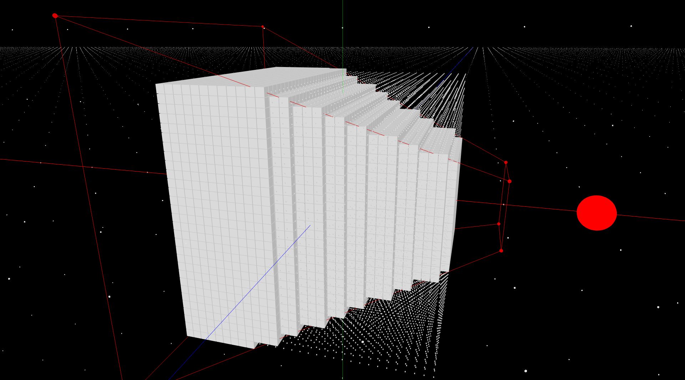

# debug-camera
Tool function to show the frustum of the camera 



### Install
Add this line to your package.json
`"debug-camera": "github:yiwenl/debug-camera"`

### Usage 
`DebugCamera(camera, color/*optional*/)`


### Example
```
import DebugCamera from 'debug-camera'

...

render() {
  ...
  DebugCamera(this.camera, [1, 0, 0])
}
```